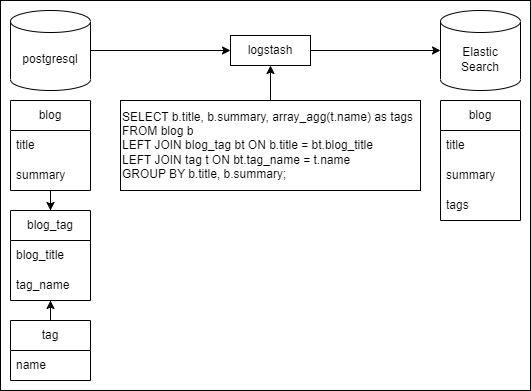

# Change Data Capture Sample



## 環境起動

```bash
docker compose up -d
```

## Elastic Search あれこれ

```bash
# mappingの登録
curl -X PUT "http://localhost:9200/blog" -H 'Content-Type: application/json' -d'
{
  "mappings": {
    "properties": {
      "title": { "type": "text" },
      "summary": { "type": "text" },
      "tags": { "type": "keyword" }
    }
  }
}'


# docの確認
curl -X GET "http://localhost:9200/blog/_search?pretty" -H 'Content-Type: application/json' -d'
{
  "query": {
    "match_all": {}
  },
  "size": 10
}'

# タイトルで検索
curl -X GET "http://localhost:9200/blog/_search?pretty" -H 'Content-Type: application/json' -d'
{
  "query": {
    "match": {
      "title": "カフェ巡り"
    }
  }
}'

# サマリーで検索
curl -X GET "http://localhost:9200/blog/_search?pretty" -H 'Content-Type: application/json' -d'
{
  "query": {
    "match": {
      "summary": "銀座のカフェを巡った日記"
    }
  }
}'
```

## Postgresql データ投入

```bash
psql -h 127.0.0.1 -U maaaashi -d blog_db
# Enter 'password'
```

```sql
-- insert
insert into blog (title, summary) values
  ('カフェ巡り', '銀座のカフェを巡った日記');

insert into tag (name) values
  ('cafe'),
  ('coffee');

insert into blog_tag (blog_title, tag_name) values
  ('カフェ巡り', 'cafe'),
  ('カフェ巡り', 'coffee');

-- update
update blog
set summary = '東京のカフェを巡った日記'
where title = 'カフェ巡り';

-- delete
delete from blog_tag
where blog_title = 'カフェ巡り';

delete from blog
where title = 'カフェ巡り';
```